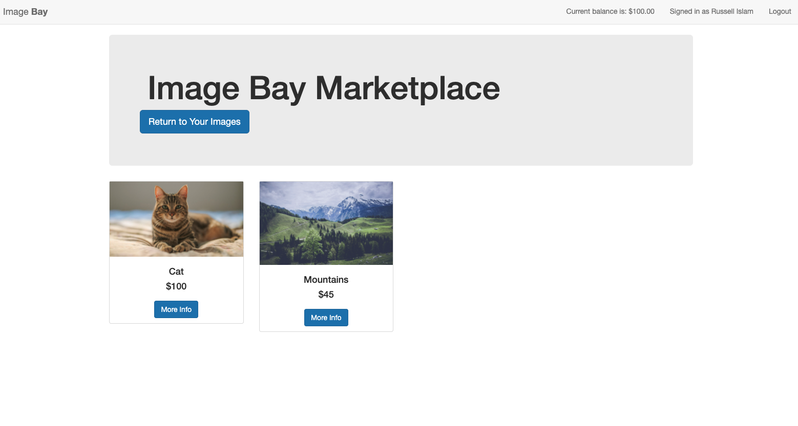

## Image Bay
### A platform to upload, share, buy and sell images

A live version deployed on Heroku can be found [here](https://whispering-bayou-81502.herokuapp.com/)

This application was made for the Shopify coding challenge for my application. It is a web application which allows users to create an account in order to upload images. Users can then list those images on the marketplace in order to sell it, while also being able to purchase images listed by other users. 


### Technologies Used
The application is built using Node.js. The backend server is created using Express as the web application framework, along with Passport.js for user authentication. EJS is used with HTML and CSS for the frontend. MongoDB is used to store user data along with image metadata. Lastly, Amazon S3 is used to store all uploaded images and binary data.

### What It Can Do
Image Bay currently supports
- Secure user registration and authentication.
- Secure image upload. Only the author of the image can view their own images. Images are stored on S3 upon upload.
- Image CRUD functionality. Users can update images, and remove images. Removing images also removes the image from S3.
- Buying and selling images
  - Every user starts with $100.
  - A user can choose any of their own images to list on the marketplace for some value. Users may also remove their images from the marketplace, should they require.
  - A user can purchase any other image from the marketplace, granted the user has enough funds.
  - Upon any transaction, both users' balances are updated accordingly. 

### How To Set It Up
If you are looking to set up the application on your machine, you would need the following:
- Node.js (and consequently, npm) version 16.X and up
- A MongoDB database if you have one already, or alternatively, an account, which you can create [here](https://www.mongodb.com/cloud/atlas/signup)
- An AWS account which you can also create [here](https://aws.amazon.com/), if you don't have one already. This is used to store images so that users can download them later.

First, you would need to download the source code. Next, you would need to make a `config/default.json` file in the root directory which would store all necessary configuration data. This file would store your Mongo URI as well as AWS configuration data. An example would be like:
```
{
  "mongoURI": "",
  "awsS3": {
    "bucketRegion": "",
    "accessKeyId": "",
    "secretAccessKey": ""
  },
  "s3Bucket": ""
}
```
Instructions for setting up a mongoDB cluster can be found [here](https://docs.atlas.mongodb.com/tutorial/create-new-cluster/), if needed. A small cluster can be created for free.

You would also need to make an S3 bucket on AWS, instructions for that can be found [here](https://docs.aws.amazon.com/AmazonS3/latest/userguide/create-bucket-overview.html)

Once those are all set up, navigate to the root directory of the source code and execute the command `npm install`. This will install all dependencies needed to run the application. Once completed, simply execute `npm start` and the application will begin running.

### How It Works

To use it, users simply need to register an account with a username, email and a password. Once registered, users will be logged in and will be presented with the option to upload any image, or to purchase any image from the marketplace, if any are available for purchase. Upon account creation, the user's dashboard will appear as so:


And after uploading a few images, your dashboard could look something like:


You can click on any photo to get more details, and the option to edit, delete, or list the image for sale.


To view the marketplace, simply click the option to view the marketplace and you can see any photos other people have listed, as well as any photos that you have listed.



And you can click on any photo to view more details, and to purchase if you have enough funds.


Look at that, we have $100 and the image is only $45. Let's purchase it.


And we can see that we have purchased the image. It is in our inventory and we can see that our balance in the top right has now decreased since we used our funds to acquire the image.

This is just a simple flow of how the application can be used.


